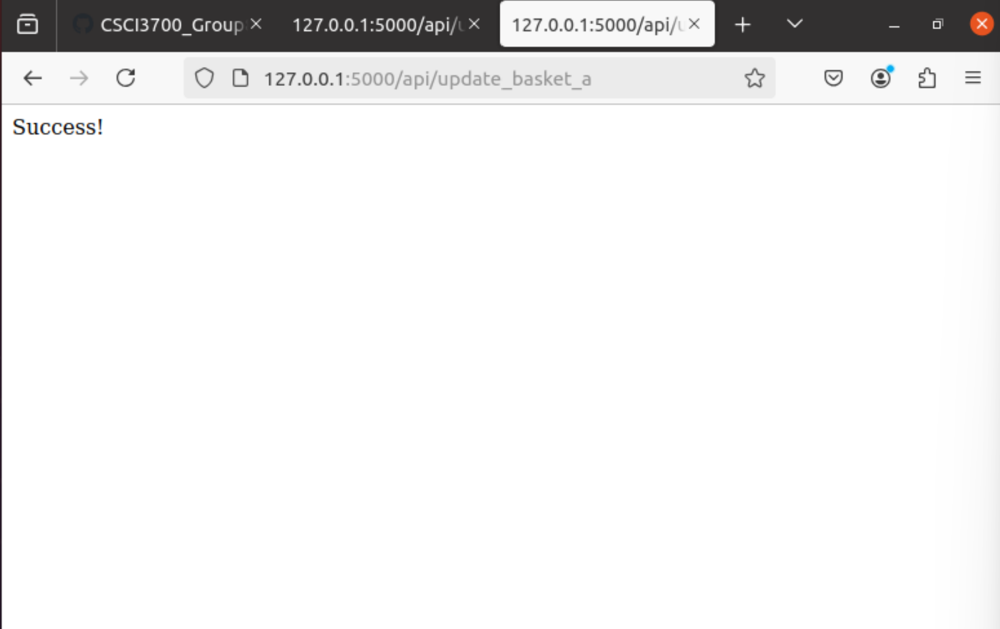
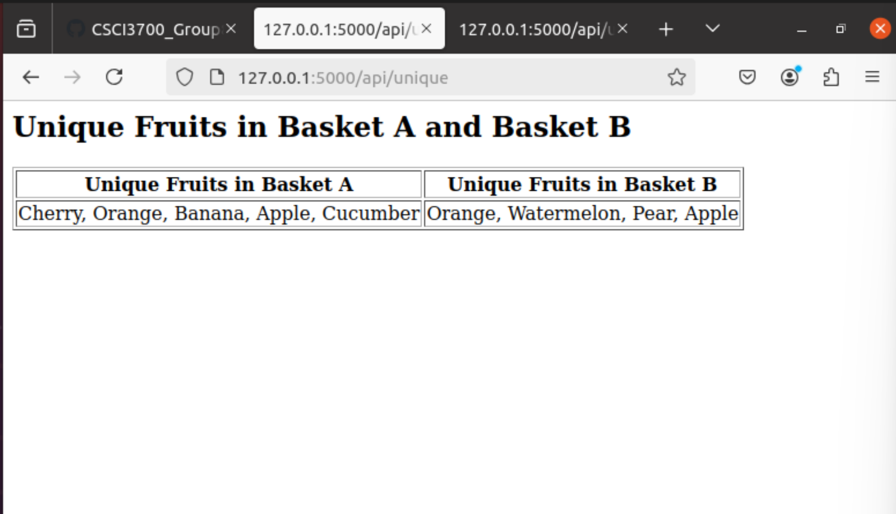

# Homework 3 - Flask and PostgreSQL Assignment

## Overview
This assignment demonstrates how to connect PostgreSQL with Flask and display the results of `SELECT` queries in an HTML table. It includes two main functionalities:

1. **Update Basket A**: Inserts a new row into the `basket_a` table.

2. **Display Unique Fruits**: Retrieves unique fruits from `basket_a` and `basket_b` tables and displays them in an HTML table.

## Quick Start

### Prerequisites
- **Python 3.8.10** or higher
- **PostgreSQL** installed and running
- **pgAdmin** 

#### Step 1: Clone the Repository 
Clone the repository to your local machine:
```
git clone https://github.com/maiyarehal/CSCI3700_Group8/tree/main/Homework3
cd Homework3
```

#### Step 2: Install Project Requirements
Inside the virtual environment, install the dependencies from `requirements.txt`:
```
pip3 install -r requirements.txt
```

#### Step 3: Set Up the PostgreSQL Database
To set up the database for this project, you can restore the server back from `local_postgres_server.sql`. This file contains the entire PostgreSQL server structure, including the database (`fruits_db`), tables (`basket_a` and `basket_b`), and all initial data.

1. **Restore the Server Using `local_postgres_server.sql`**:

    - **Using pgAdmin**:

        1. Open pgAdmin and connect to PostgreSQL instance.

        2. Right-click Servers and select Restore...

        3. In the Restore menu, choose `local_postgres_server.sql` as the file to restore.

        4. Click Restore to complete the process. This will recreate the `fruits_db` database with all required tables and data. 

    - **Using the Command Line**:
        ```
        pg_restore -U postgres -d postgres -1 local_postgres_server.sql
        ```
        - Replace `postgres` in `-U postgres` with your PostgreSQL username on your local setup.
        - This command restores the server structure, including the `fruits_db` database with all necessary tables and data.

        **Note: Restoring from `local_postgres_server.sql` will create the `fruits_db` database with `basket_a` and     `basket_b` tables prepopulated with the required data.**

#### Step 4: Configure the Database Connection
Open `main.py` and set the database credentials according to your PostgreSQL setup:
```
app.config['DB_NAME'] = 'fruits_db'           
app.config['DB_USER'] = 'your_username'       
app.config['DB_PASSWORD'] = 'your_password'   
app.config['DB_HOST'] = 'localhost'           
```

Replace `your_username` and `your_password` with your own PostgreSQL credentials. These settings allow the application to connect to your PostgreSQL instance.

#### Step 5: Start the Flask Server
With the virtual environement still activated, run the Flask server: 
```
python3 main.py
```
The server will start on `http://127.0.0.1:5000`.

### Testing the Endpoints

#### Endpoint 1: Update Basket A

- **URL**: `http://127.0.0.1:5000/api/update_basket_a`
- **Expected Output**: Shows "Success!" if the insertion is successful or an error message of there's a conflict.


#### Endpoint 2: Display Unique Fruits

- **URL**: `http://127.0.0.1:5000/api/unique`
- **Expected Output**: HTML table showing unique fruits or an error message if there's a query issue.


### Project Structure:

- **`local_postgres_server.sql`**: Full PostgreSQL server backup file, containing `fruits_db` with tables and data.
- **`fruits_db.sql`**: SQL file with commands to create `basket_a` and `basket_b` tables and insert initial data.
- **`main.py`**: Contains the main Flask application, with routes for updating `basket_a` and displaying unique fruits.
- **`util.py`**: Defines helper functions, including the database connection function.
- **`requirements.txt`**: Lists the dependencies required to run the application.
