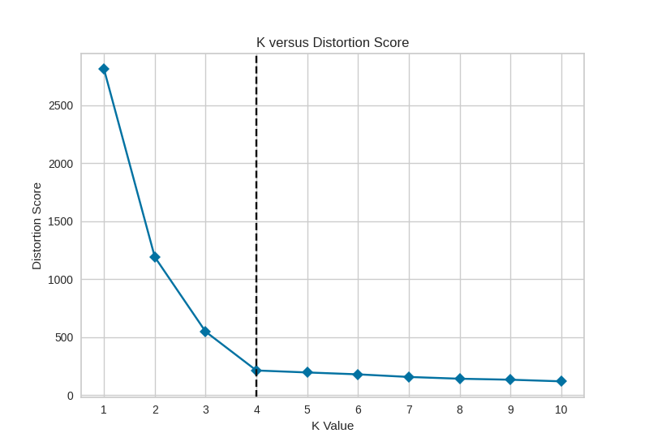
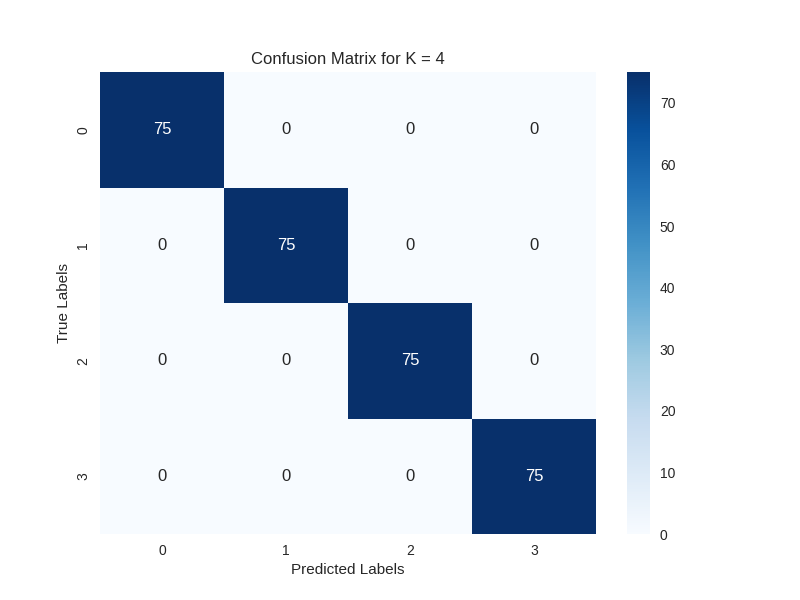

# HW2 - KMeans Clustering and Elbow Method

## Project Overview
This project focuses on using the KMeans clustering algorithm to classify a synthetic dataset into clusters. The optimal number of clusters (K) is determined using the Elbow Method, implemented through the `KElbowVisualizer` from the `yellowbrick` library. The project involves:
   - Using the `KElbowVisualizer` to plot distortion scores and identify the best K value.
   - Applying KMeans clustering to group data points based on the identified K.
   - Evaluating the clustering performance by calculating accuracy and visualizing the confusion matrix.
   - Providing clear visual representations to aid in understanding the clustering results.
     
## Quick Start

### Prerequisites
Before running the code, make sure you have Python installed along with the necessary dependencies. You can install the dependencies using `pip` and the provided `requirements.txt` file. 
```
pip install -r requirements.txt
```
   
Install Additional Packages (if needed): For some systems, you may need to install the `python3-tk` package:  
```
sudo apt-get update
sudo apt-get install python3-tk
```

If there are errors, run:
```
sudo apt --fix-broken install
```

### Running the Code
1. Make sure the following files are present in the directory:
   - `main.py`
   - `confusion_matrix.png`
   - `k_elbow.png`
   - `requirements.txt`
     
2. Execute the Python script to generate the elbow plot and confusion matrix:
   ```
   python3 main.py
   ```
   
3. Outputs:
   - The elbow plot for K selection is saved as `k_elbow.png`.
   - The confusion matrix for the best K is saved as `confusion_matrix.png`.
  
## Dependencies
This project requires the following Python libraries (listed in `requirements.txt`):
  - scikit-learn
  - yellowbrick
  - matplotlib
  - seaborn
  - numpy
  - scipy

To install these dependencies, use:
```
pip install -r requirements.txt
```

## Determining the Best K
The script uses the `KElbowVisualizer` from the `yellowbrick` library to determine the optimal number of clusters (K). The elbow plot (`k_elbow.png`) shows the distortion score for each K value, and the best K is indicated by the "elbow" point on the plot.
#### K Elbow Plot


## Accuracy Calculation for the Best K
The script calculates the accuracy for the best K by mapping the cluster labels from the KMeans model to the true labels using a confusion matrix. This process helps to understand how well the clustering aligns with the actual data distribution. The accuracy score is 100% considering the data is simple and not complex.

## Confusion Matrix
The script generates a confusion matrix using the `confusion_matrix` function from `sklearn.metrics` and visualizes it using `seaborn`. The confusion matrix for the best K is saved as `confusion_matrix.png`. It shows how well the clustering labels match the true labels.
#### Confusion Matrix for Best K


## File Descriptions
   - `main.py`: The main Python script that performs the following tasks:
      - Uses `KElbowVisualizer` to determine the best K.
      - Fits the KMeans model and predicts clusters.
      - Maps cluster labels to true labels and calculates accuracy.
      - Generates and saves the elbow plot and confusion matrix.
   - `requirements.txt`: Lists all necessary Python libraries for this project:
   - `k_elbow.png`: The elbow plot used to identify the optimal number of clusters (K).
   - `confusion_matrix.png`: The confusion matrix representing the clustering results for the best K.

## References
   - Scikit-learn: [Scikit-learn](https://scikit-learn.org)
   - Yellowbrick Documentation: [Yellowbrick Documentation](https://www.scikit-yb.org)
