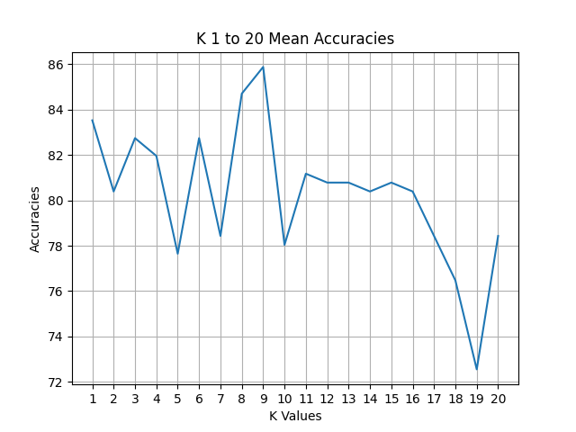

# Group 8 - KNeighbors (KNN) Classifier

## Project Overview
This project uses the K-Nearest Neighbors (KNN) algorithm to classify the Iris dataset. The classifier is tested on a range of K values (1 to 20) and evaluates the mean accuracy for each K value. The results are plotted on a line chart.

## Quick Start

### Prerequisites
Before running the code, make sure you have Python installed along with the necessary dependencies. You can install the dependencies using `pip` and the provided `requirements.txt` file.

```
pip install -r requirements.txt
```

### Running the Code
1. Make sure the following files are present in the directory:
   - `KNeighbors.py`: The main script to run the KNN classifier.
   - `func.py`: A helper function to load the Iris dataset.
   - `iris.data`: The Iris dataset file.
   - `requirements.txt`: The list of dependencies.

2. Run the `KNeighbors.py` script to evaluate the KNN algorithm for K values from 1 to 20.
```
python KNeighbors.py
```

3. The output will show the mean accuracy for each K value, and a line chart (`kvalues.png`) will be generated to visualize the results.

### Note:
- The dataset is split into a training set (66%) and a test set (34%) for evaluation.
- The mean accuracy is computed by running each K value five times, then averaging the results.
- The line chart generated by `matplotlib` shows the mean accuracies for K values from 1 to 20.

## Results

### Line Chart of K Values


### Best K Value
The K value that yields the highest mean accuracy is **K = 9**, with a mean accuracy of approximately **86%**. While K = 9 performs the best, many other K values yield similar accuracies between **76% and 86%**.

### Why Similar Accuracy Across Ks?
The Iris dataset is relatively straightforward, with well-defined class boundaries. This allows the KNN classifier to perform consistently across a wide range of K values. Minor variations in accuracy are likely due to different random splits between the training and test sets. As K increases, the classifier generalizes more by considering more neighbors, leading to smoother decision boundaries. While this can provide better generalization, it may also slightly decrease accuracy in some cases by over-smoothing the decision boundary.

## Dependencies
The following Python libraries are required to run the project:
- `pandas`
- `matplotlib`
- `scikit-learn`

You can install these dependencies using the provided `requirements.txt`.
```
pip3 install -r requirements.txt
```

## File Structure
- `KNeighbors.py`: Contains the main logic for running the KNN classifier with K values from 1 to 20.
- `func.py`: Helper function to load the dataset and split it into training and test sets.
- `iris.data`: The Iris dataset.
- `requirements.txt`: List of dependencies required for the project.
- `kvalues.png`: The generated line chart of mean accuracies for K values 1 to 20.
