# Internship Projects

## 1. Advanced AI Metrics Dashboard
- This interactive Power BI dashboard provides a comprehensive view of AI adoption trends in the organization, helping leadership understand how employees are integrating AI into their workflows. Built with custom DAX measures and drill-through capabilities, users can explore AI use cases at a granular level. The dashboard features three embedded Copilot narratives that dynamically summarize the top five AI applications and emerging trends, offering immediate business insights. Additionally, I designed pop-out windows for each key feature tab, allowing users to view in-depth details without cluttering the main dashboard view. This approach enhances usability and ensures a seamless, intuitive experience for decision-makers looking to track AI integration across the organization.
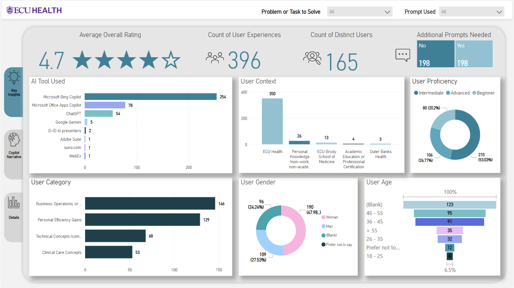
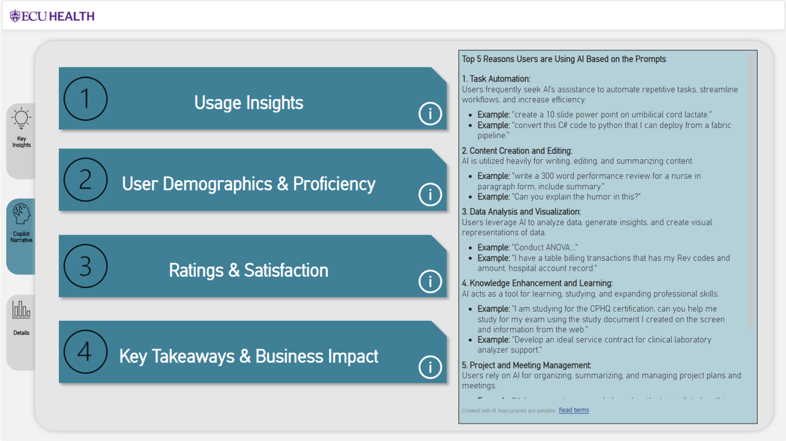
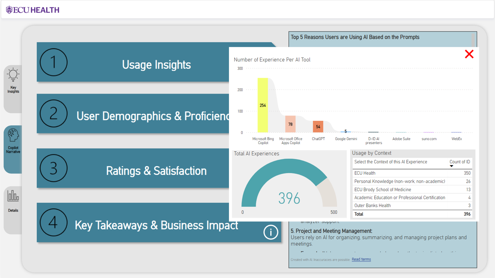
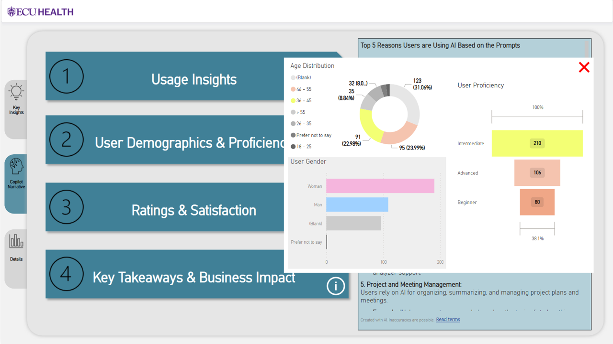
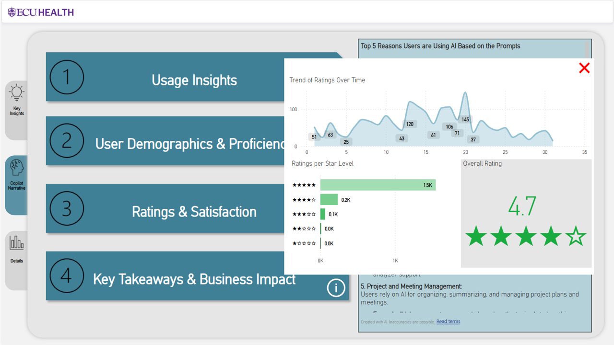
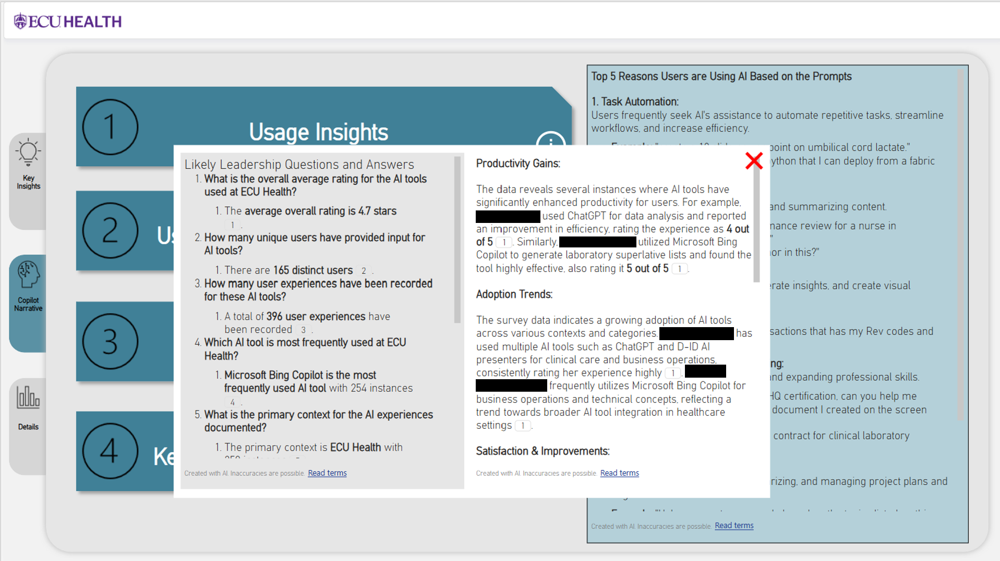

## 2. Report and Workspace Utilization Dashboard
- This enterprise-wide dashboard monitors report and workspace usage across the organization. It pulls data from a data warehouse, incorporating custom DAX measures for refined searches and drill-through functionality to hone in on key details. A core feature is the automated archival system, which identifies and flags reports and workspaces inactive for 90+ days, allowing teams to maintain a clean and efficient reporting environment. This initiative ensures that critical reports remain accessible, while redundant or outdated assets are systematically archived, improving overall data efficiency and operational decision-making.
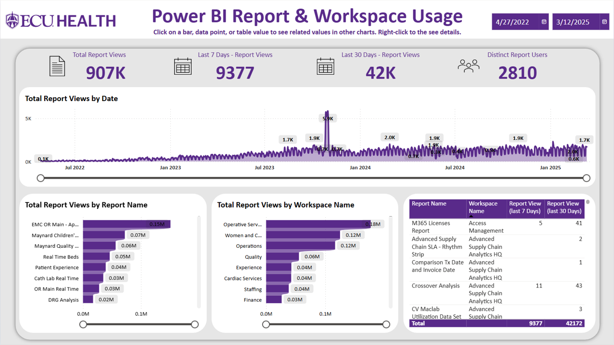
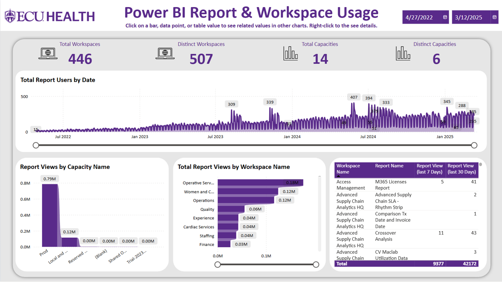
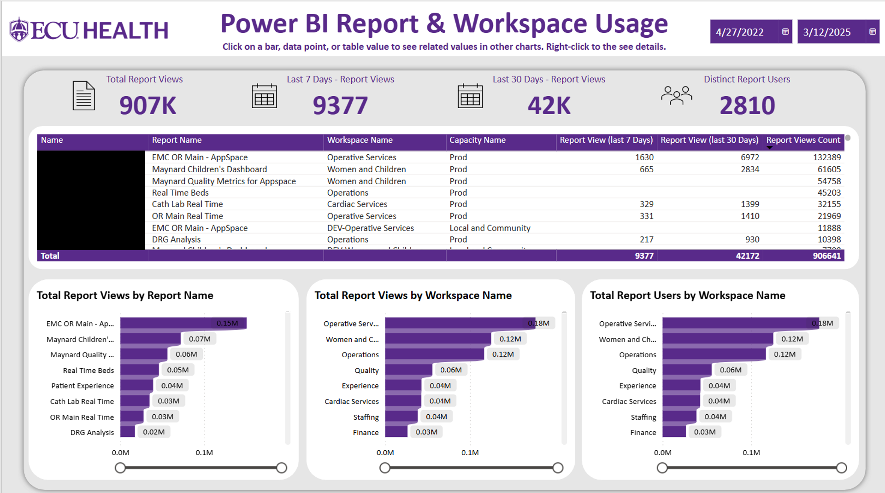
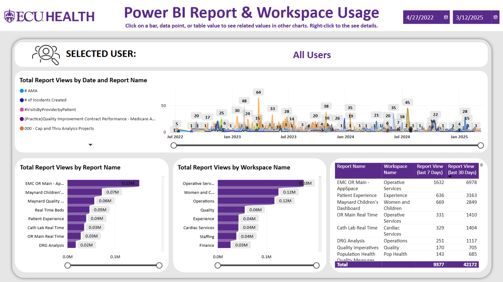
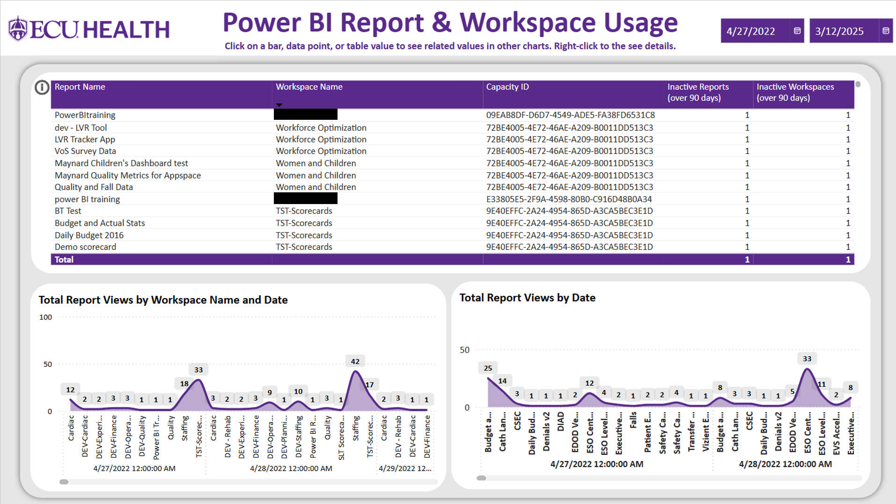
